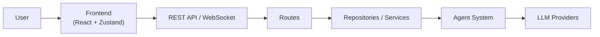
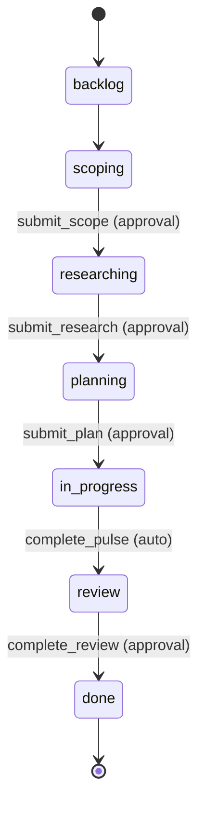

# Architecture

Autarch is a Bun-powered monorepo combining a React frontend with an agent-based AI workflow backend. The frontend and backend communicate via WebSocket (real-time events) and REST API (request-response), sharing a TypeScript schema layer built on Zod to ensure type safety across the boundary.

## High-Level Overview

The backend runs on the Bun runtime with `src/backend/index.ts` as the entry point, which initializes the server, databases, repositories, session manager, workflow orchestrator, and embedding file watcher. The React frontend is organized by feature under `src/features/` and uses Zustand for state management. Ten agent roles — each with a prompt-per-role configuration and curated tool set — drive the AI workflow pipeline. Four SQLite databases handle persistence (global settings, project data, embeddings, and knowledge). Shared Zod schemas in `src/shared/schemas/` define the contract between frontend and backend.

## Workflow State Machine

Workflows progress through a linear 7-stage pipeline, where each stage is owned by a dedicated agent role. Transitions between stages are gated by tool calls — some requiring user approval, others firing automatically.

**Approval gates.** The tools `submit_scope`, `submit_research`, `submit_plan`, and `complete_review` all require explicit user approval before the workflow advances to the next stage. This gives the user a checkpoint to review agent output, request changes, or deny the artifact.

**Auto-transitions.** When an execution agent calls `complete_pulse`, the workflow moves to `review` automatically with no approval step — the review agent picks it up immediately.

**Quick vs full path.** During scoping, the agent produces a `recommendedPath` of either `quick` or `full`. A quick-path workflow skips the `researching` and `planning` stages entirely, jumping straight from `scoping` to `in_progress`. Skipped stages are tracked in the `skippedStages` field on the workflow record.

**Git worktree isolation.** Each workflow runs in its own git worktree on a dedicated branch, keeping in-progress changes isolated from the main codebase and from other workflows.

See `src/shared/schemas/workflow.ts` for stage definitions, transition maps, and approval/auto-transition tool sets. See `src/backend/agents/runner/WorkflowOrchestrator.ts` for the orchestration logic that processes tool calls and manages stage transitions.
