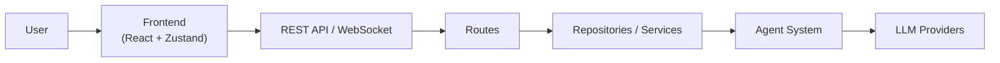
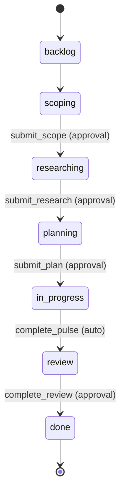

# Architecture

Autarch is a Bun-powered monorepo combining a React frontend with an agent-based AI workflow backend. The frontend and backend communicate via WebSocket (real-time events) and REST API (request-response), sharing a TypeScript schema layer built on Zod to ensure type safety across the boundary.

## High-Level Overview

The backend runs on the Bun runtime with `src/backend/index.ts` as the entry point, which initializes the server, databases, repositories, session manager, workflow orchestrator, and embedding file watcher. The React frontend is organized by feature under `src/features/` and uses Zustand for state management. Ten agent roles — each with a prompt-per-role configuration and curated tool set — drive the AI workflow pipeline. Four SQLite databases handle persistence (global settings, project data, embeddings, and knowledge). Shared Zod schemas in `src/shared/schemas/` define the contract between frontend and backend.

## Workflow State Machine

Workflows progress through a linear 7-stage pipeline, where each stage is owned by a dedicated agent role. Transitions between stages are gated by tool calls — some requiring user approval, others firing automatically.

**Approval gates.** The tools `submit_scope`, `submit_research`, `submit_plan`, and `complete_review` all require explicit user approval before the workflow advances to the next stage. This gives the user a checkpoint to review agent output, request changes, or deny the artifact.

**Auto-transitions.** When an execution agent calls `complete_pulse`, the workflow moves to `review` automatically with no approval step — the review agent picks it up immediately.

**Quick vs full path.** During scoping, the agent produces a `recommendedPath` of either `quick` or `full`. A quick-path workflow skips the `researching` and `planning` stages entirely, jumping straight from `scoping` to `in_progress`. Skipped stages are tracked in the `skippedStages` field on the workflow record.

**Git worktree isolation.** Each workflow runs in its own git worktree on a dedicated branch, keeping in-progress changes isolated from the main codebase and from other workflows.

See `src/shared/schemas/workflow.ts` for stage definitions, transition maps, and approval/auto-transition tool sets. See `src/backend/agents/runner/WorkflowOrchestrator.ts` for the orchestration logic that processes tool calls and manages stage transitions.

## Backend Structure

The backend lives in `src/backend/` and is organized into agents, tools, services, git integration, an LLM layer, WebSocket broadcasting, repositories, and routes.

### Agents

Ten agent roles drive the workflow pipeline: `basic`, `discussion`, `scoping`, `research`, `planning`, `preflight`, `execution`, `review`, `roadmap_planning`, and `review_sub`. Each role has a dedicated system prompt that defines its behavior and personality — these live in `src/backend/agents/prompts/`, one file per role.

The agent runner in `src/backend/agents/runner/` manages execution. `AgentRunner` handles the LLM interaction loop, `SessionManager` tracks active sessions, and `WorkflowOrchestrator` processes tool calls, manages stage transitions, and enforces approval gating.

### Agent & Tool Registry Pattern

`src/backend/agents/registry.ts` maps each of the 10 `AgentRole` values to an `AgentConfig` containing: a `systemPrompt` function, a `tools` array of `RegisteredTool` objects, `maxTokens`, and `temperature`. Tool sets are composed per role by spreading tool category arrays (e.g., `...baseTools`, `...pulsingTools`, `...typescriptTools`) and cherry-picking individual block tools via `registerTool()` (e.g., `registerTool(submitScopeTool)`). This makes each role's capabilities explicit and auditable in a single file.

The flat `toolRegistry` in `src/backend/tools/index.ts` indexes all tools by name for runtime lookup via `getTool()` and `getToolNames()`. This provides name-based access when the agent runner needs to resolve tool calls from the LLM.

### Tool Categories

Six categories under `src/backend/tools/` organize tools by concern:

- **`base/`** — Read-only codebase access: file reading, search, directory listing. Also exports `todoTools` for agent task tracking.
- **`blocks/`** — Structured output tools that complete stages: `submit_scope`, `submit_research`, `submit_plan`, `complete_pulse`, `complete_review`, plus `ask_questions` and `request_extension`.
- **`preflight/`** — Environment setup before pulse execution (dependency installation, baseline capture).
- **`pulsing/`** — Code modification tools: file writing, patching, shell commands.
- **`review/`** — Code review tools: diff access, line/file/review comments, sub-review spawning.
- **`typescript/`** — TypeScript-specific analysis tools (symbol lookup).

### Services

Service directories in `src/backend/services/` encapsulate domain logic:

- **`cost/`** — LLM cost tracking and reporting.
- **`embedding/`** — Code embedding generation and vector storage.
- **`knowledge/`** — Knowledge extraction and retrieval from codebase analysis.
- **`pulsing/`** — Pulse orchestration and execution lifecycle.
- **`shell-approval/`** — User approval flow for shell commands executed by agents.

Standalone service files handle cross-cutting concerns: `globalSettings.ts` and `projectSettings.ts` (configuration), `project.ts` (project initialization), `ripgrep.ts` (fast text search via rg), `subtasks.ts` (sub-task management), and `embed.ts` (embedding coordination).

### Git Integration

Each workflow gets its own git worktree on a dedicated branch, providing full isolation between concurrent workflows. The git layer in `src/backend/git/` manages worktree creation and cleanup (`worktrees.ts`), branch lifecycle — create, merge, delete (`branches.ts`, `merges.ts`), commit operations (`commits.ts`), and diff generation (`diffs.ts`). All git operations go through a shared executor (`git-executor.ts`) that handles process spawning and error handling.

### LLM Layer

Multi-provider LLM support is built on the Vercel AI SDK. Four providers are supported: Anthropic, OpenAI, Google, and xAI. `src/backend/llm/models.ts` provides `getModelForScenario()`, which maps an agent role to the user's configured model preference and creates the appropriate AI SDK model instance via provider-specific factory functions (`createAnthropic`, `createOpenAI`, `createGoogleGenerativeAI`, `createXai`).

### WebSocket Layer

The WebSocket layer uses Bun's native `ServerWebSocket` for broadcast-only real-time communication. All events are typed via `WebSocketEvent` (defined in `src/shared/schemas/events.ts`). The server broadcasts state changes — workflow transitions, agent messages, tool results — to all connected clients. There is no client-to-server messaging over WebSocket; all client requests go through REST. See `src/backend/ws/`.

### Repository & Data Access Layer

Data access follows a repository-per-domain pattern. Each repository class (`WorkflowRepository`, `ChannelRepository`, `SessionRepository`, `ConversationRepository`, `ArtifactRepository`, `PulseRepository`, `RoadmapRepository`) takes a Kysely database instance, implements domain-specific queries, and maps database rows to domain objects via private mapping methods. Repositories are organized with Read/Write section dividers for clarity. Kysely serves as the query builder. See `src/backend/repositories/`.

### Routes & API Surface

RESTful HTTP routes are organized by domain in `src/backend/routes/`. Eight route files cover the API surface: `workflowRoutes`, `sessionRoutes`, `channelRoutes`, `roadmapRoutes`, `questionRoutes`, `shellApprovalRoutes`, `toolRoutes`, and `settings`. These are aggregated in `src/backend/routes/index.ts` and mounted on the Bun server at startup.

### Shared Schemas

TypeScript types shared between frontend and backend live in `src/shared/schemas/`. The project uses Zod for runtime validation with inferred TypeScript types (`z.infer`). Twelve schema files cover: channels, embeddings, events, hooks, models, projects, questions, roadmaps, sessions, settings, workflows, plus an index barrel export. These schemas define the contract between frontend and backend — any data crossing the boundary conforms to these definitions.

## Frontend Structure

The frontend lives in `src/features/` and follows a feature-sliced organization pattern, where each top-level directory owns all code for a distinct area of the application.

### Feature Directories

- **`dashboard/`** — Main workflow management interface: workflow list, detail views, and conversation threads.
- **`onboarding/`** — Initial setup and configuration flow.
- **`settings/`** — Application settings management.
- **`testbench/`** — Development and testing utilities.
- **`roadmap/`** — Roadmap visualization and planning.
- **`websocket/`** — WebSocket connection management and event handling.

### Internal Structure

Each feature directory can contain a combination of these subdirectories:

- **`api/`** — API client functions for communicating with the backend.
- **`components/`** — React components scoped to the feature.
- **`store/`** — Zustand state stores.
- **`hooks/`** — Custom React hooks.

Not every feature has all subdirectories — each includes only what it needs. For example, `websocket/` is minimal (just a store and barrel export), while `dashboard/` has `api/`, `components/`, `store/`, and `utils/`.

### Key Patterns

Zustand stores hold state and actions in a single store per concern (e.g., `workflowsStore.ts`, `discussionsStore.ts`). The frontend uses shadcn/ui primitives for UI components. API clients are per-feature and communicate with the backend via REST endpoints.

## Database Architecture

Autarch uses 4 separate SQLite databases, each serving a distinct concern. All are managed via Kysely as the query builder.

The database layer lives in `src/backend/db/`, with each database in its own subdirectory containing types, migrations, and connection setup.

### Global Database

`src/backend/db/global/` — Application-wide settings stored as a key-value store.

**Tables:** `settings`.

### Project Database

`src/backend/db/project/` — Core workflow and session data. This is the largest database (~25 tables), with tables grouped by concern:

- **Workflow structure:** `workflows`, `channels`, `project_meta`.
- **Conversation history:** `sessions`, `turns`, `turn_messages`, `turn_tools`, `turn_thoughts`, `subtasks`, `session_notes`, `session_todos`.
- **Artifacts:** `scope_cards`, `research_cards`, `plans` (stage outputs with approval status).
- **Execution:** `pulses`, `preflight_setup`, `preflight_baselines`, `preflight_command_baselines`.
- **Review:** `review_cards`, `review_comments`.
- **Roadmaps:** `roadmaps`, `milestones`, `initiatives`, `vision_documents`, `dependencies`.
- **Other:** `questions`.

### Embeddings Database

`src/backend/db/embeddings/` — Content-addressable code chunks and vector storage for semantic search.

**Tables:** `embedding_chunks` (content-addressable text chunks), `vec_chunks` (vector embeddings), `embedding_scopes` (scope boundaries), `file_chunk_mappings` (file-to-chunk relationships).

### Knowledge Database

`src/backend/db/knowledge/` — Extracted knowledge items with embeddings for retrieval.

**Tables:** `knowledge_items`, `knowledge_embeddings`.
